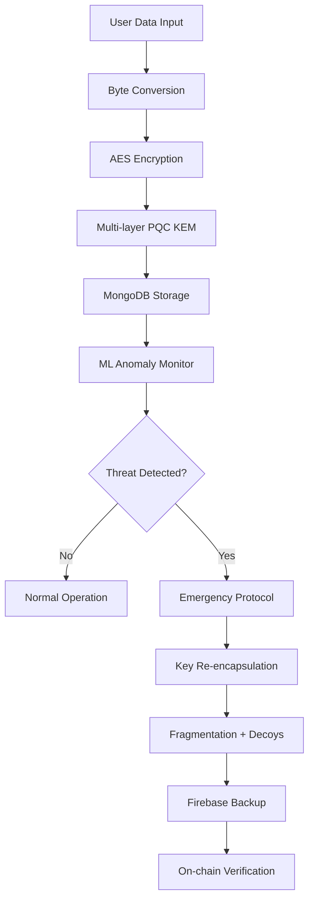

#  CryptonZT

<div align="center">


### **Quantum-Resistant Key & Data Protection Layer for Web3** 🔐

[](https://github.com/SURIYAPRASAAD04/CryptonZT)
[](https://youtu.be/aYYoM2eZA-Q)
[](https://youtu.be/5gms7-lGBYY)
[](https://drive.google.com/drive/folders/1BUPTkQP4TEwCYBLkbnCF-9j_94_uMP8G?usp=sharing)

**CryptonZT** is a **zero-trust**, **post-quantum cryptography (PQC)**, and **ML-powered** security service designed to protect blockchain private keys, dApp data, and transaction security in the **quantum computing era**.

*Making blockchain security **future-proof** today.*

</div>

---

## **The Quantum Threat is Real**

Current blockchain cryptography (ECDSA, RSA, EdDSA, ECDH) faces an **existential threat** from quantum computing. Algorithms like **Shor's** and **Grover's** will eventually:

-  **Crack private keys** in minutes instead of millennia
-  **Compromise wallets** and steal digital assets
-  **Break smart contracts** and DeFi protocols
-  **Undermine Web3** infrastructure security

**We cannot wait for the first quantum breach — security must evolve NOW.**

---

##  **The CryptonZT Solution**

<div align="center">

###  **Multi-Layered Quantum Defense**

</div>

CryptonZT provides comprehensive protection through:

### **Core Features**

- ** Multi-layer PQC KEM Protection** - NIST-approved post-quantum algorithms
- ** ML-powered Anomaly Detection** - Real-time threat monitoring
- ** Zero-trust Architecture** - No endpoint is inherently trusted
- ** Emergency Escape Mechanism** - Automatic key re-encapsulation on breach
- ** Blockchain Integration** - On-chain quantum-resilient verification
- ** Dynamic Key Fragmentation** - Distributed security with decoy generation

###  **Key Benefits**

| Feature | Traditional Security | CryptonZT |
|---------|---------------------|-----------|
| Quantum Resistance | ❌ Vulnerable | ✅ Future-proof |
| Threat Detection | ❌ Reactive | ✅ Proactive ML |
| Key Protection | ❌ Single layer | ✅ Multi-layer PQC |
| Emergency Response | ❌ Manual | ✅ Automated |
| Blockchain Ready | ❌ Limited | ✅ Full integration |

---

## 🛠️ **Technology Stack**

<div align="center">


</div>

###  **Detailed Stack**

**Backend & API**
-  **Flask (Python)** - Lightweight, scalable API framework
-  **RESTful Architecture** - Clean, standardized endpoints

**Database Layer**
-  **MongoDB (Primary)** - High-performance document storage
-  **Firebase (Backup)** - Cloud-native redundancy

**Cryptographic Core**
-  **NIST PQC Algorithms** - Kyber, Dilithium, SPHINCS+
-  **Custom KEM Implementation** - Multi-layer encapsulation

**Machine Learning**
-  **Scikit-learn** - Classical ML anomaly detection
-  **TensorFlow** - Advanced neural network models

**Blockchain Integration**
-  **Web3.py** - Ethereum ecosystem integration
-  **Ganache/Sepolia** - Development and testing networks

**DevOps & Deployment**
-  **Docker** - Containerized services
-  **Cloud-Ready** - Multi-platform deployment

---

##  **System Workflow**

<div align="center">



</div>

###  **Step-by-Step Process**

1. ** Data Upload** - User submits sensitive data (files, text, JSON, keys)
2. ** Processing** - Data converted to secure byte format
3. ** Encryption** - AES encryption with quantum-safe parameters
4. ** PQC Protection** - Multi-layer key encapsulation mechanism
5. ** Secure Storage** - Encrypted data stored in MongoDB
6. ** Monitoring** - ML algorithms continuously monitor for anomalies
7. ** Threat Response** - Automatic security escalation on detection
8. **⛓ Blockchain Proof** - Optional on-chain verification for transparency

---

##  **Project Screenshots**

<div align="center">


</div>

---


###  **Running the Application**

```bash
# Start MongoDB service
sudo systemctl start mongod

# Run the Flask backend
python Blockchain.py

# Access the application
# Open browser: http://localhost:5000
```


##  **Video Resources**

<div align="center">

###  **Watch Our Demo**
[](https://youtu.be/vZifeU7olus)

*Click above to see CryptonZT in action!*

###  **Product Launch Presentation**
[](https://youtu.be/5gms7-lGBYY)

*Complete product overview and technical deep-dive*

</div>

---

##  **Hackathon Journey**

###  **Pre-existing Foundation**
- Core PQC + zero-trust architecture concept
- Initial ML anomaly detection research
- Theoretical framework development

###  **Built During Hackathon**
- ✅ Complete Flask backend with PQC integration
- ✅ Comprehensive API endpoints for encryption
- ✅ Full blockchain module for Web3 integration  
- ✅ Advanced escape mechanism for anomaly events
- ✅ Real-time dashboard and monitoring system
- ✅ Docker containerization and deployment

###  **Achievements**
-  **Innovation in Security** - Novel multi-layer PQC approach
-  **Technical Excellence** - Production-ready codebase
-  **Practical Impact** - Addresses real quantum threat

---

##  **Contributing**

We welcome contributions to CryptonZT! Here's how you can help:

### 🔍 **Areas of Interest**
- Post-quantum cryptography implementations
- Machine learning anomaly detection
- Blockchain security protocols
- Performance optimization
- Security auditing

###  **Contribution Process**

1. Fork the repository
2. Create a feature branch (`git checkout -b feature/AmazingFeature`)
3. Commit your changes (`git commit -m 'Add AmazingFeature'`)
4. Push to the branch (`git push origin feature/AmazingFeature`)
5. Open a Pull Request

---


## **Contact & Support**

<div align="center">

### 🔗 **Important Links**

[](https://github.com/SURIYAPRASAAD04/CryptonZT)
[](https://drive.google.com/drive/folders/1BUPTkQP4TEwCYBLkbnCF-9j_94_uMP8G?usp=sharing)

### **Show Your Support**

If CryptonZT helps secure your Web3 future, please ⭐ **star this repository**!

</div>

---

<div align="center">

###  **Securing Tomorrow's Digital World Today**

**CryptonZT** - Because quantum-safe is the only safe.

*Built with ❤️ for the quantum-resistant future*

</div>

